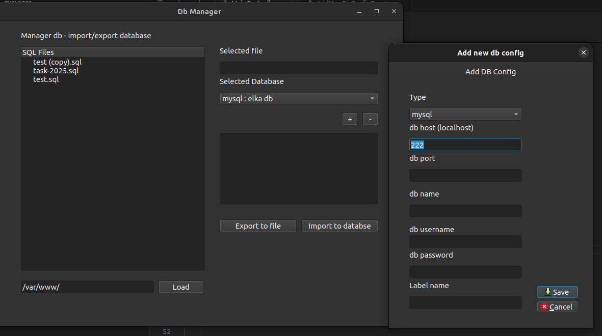

# Db manager

Manager database allowing user  to export and import data from file sql. 
Application and be extended for new db like mongodb or other dbs in /builders/dbManager.py

Python with library Qt




### Envirement

```bash
# create env/ install packages
. ./console install
# Enter
. ./console env
# Exit
. ./console exit
```

### Export packages

```
./console freeze
```

### Run Qt designer

GUI User editor

```
./console designer
```


### Migracje

```
alembic revision --autogenerate -m "initial migration"
alembic upgrade head
```


### Generate app exec file

Exec file

```
./venv/bin/pyinstaller app.py \
  --onedir \
  --clean \
  --noconfirm \
  --add-data "views:views" \
  --collect-all PyQt6 \
  --collect-all PyQt6.Qt6 \
  --collect-all PyQt6.QtCore \
  --collect-all PyQt6.QtGui \
  --collect-all PyQt6.QtWidgets \
  --add-binary "$(python3 -c 'import sysconfig; print(sysconfig.get_config_var("LIBDIR"))')/libpython3.10.so.1.0:."
```

generated file: /dist/app

### Debugging vscode

Display/view/edit app.py, add breakpoint and click F5